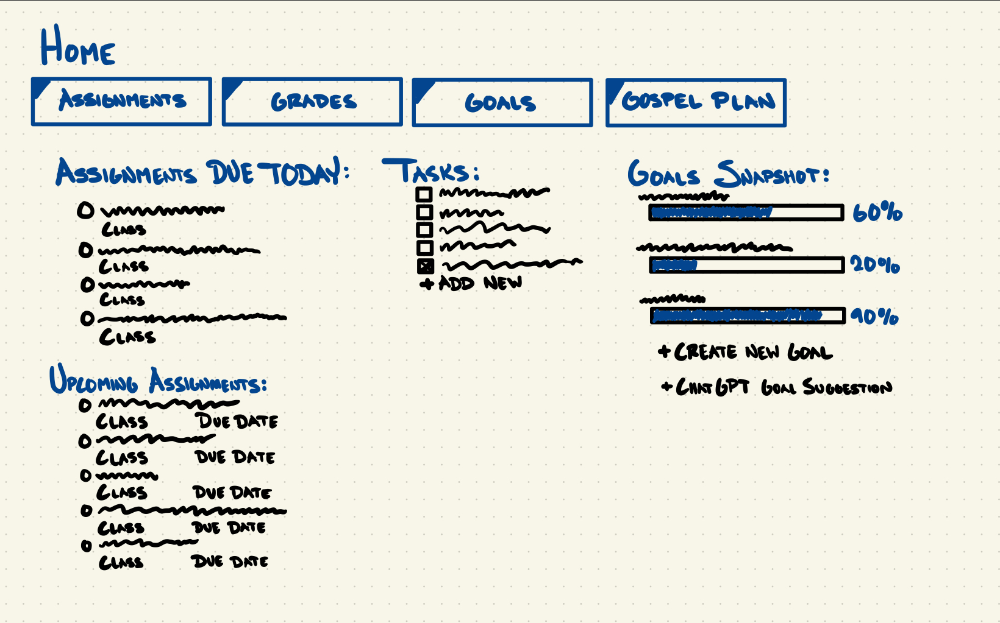

# Procrastinot

[My Notes](notes.md)

## 🚀 Specification Deliverable

For this deliverable I did the following. I checked the box `[x]` and added a description for things I completed.

- [X] Proper use of Markdown
- [X] A concise and compelling elevator pitch
- [X] Description of key features
- [X] Description of how you will use each technology
- [ ] One or more rough sketches of your application. Images must be embedded in this file using Markdown image references.

### Elevator pitch

Frustrated with switching between Learning Suite, Canvas, and a thousand other platforms for school assignments? Tired of losing track of your new years resolutions? Wouldn't it be great if there was just a single place to keep track of everything... if only... but wait! Look no farther than **Procrastinot**, an all new platform designed to let you focus on what matters most: the homework itself, your goals, and your gospel study! Find all you homework assignments in one place, keep track of and review your personal goals, and create a personalized gospel study plan for the week.  

### Design

Here's a few pictures demonstrating a basic design as well as some of the features:

### Key features

- Secure login to access your personal dashboard
- All homework assignments displayed in one place and ranked by priority
- Task manager for any other non-school related tasks
- Personal goals tracker with progress indicators
- Customizable gospel study plan on a week by week basis
- Suggested goals from ChatGPT

### Technologies

I am going to use the required technologies in the following ways:

- **HTML** - Give the structure of the entire application. Multiple HTML pages, including one for login, one for the main dashboard, another for tracking goals, and another for gospel study plans. 
- **CSS** - Provide style to the website with a good color scheme, fonts, and use of whitespace. 
- **React** - Display assignment status including the due date and submission status. Allow users to add, edit, and delete tasks and goals. Shows progress towards goals and gospel study plan. 
- **Service** - Backend service with endpoints for the following:
    - Retrieving assignments and updating their status
    - Login and logout functionality
    - Suggest goals using ChatGPT API
    - Send notifications for upcoming assignments and tasks
- **DB/Login** - Store login credentials securely. Store personalized user data including their assignments, goals and progress towards them, and their gospel study plan. 
- **WebSocket** - New assignments or adjusted due dates are updated immediately on the webpage. _Possibly (time permitting) display grades of assignments as they are graded._

## 🚀 AWS deliverable

For this deliverable I did the following. I checked the box `[x]` and added a description for things I completed.

- [ ] **Server deployed and accessible with custom domain name** - [My server link](https://yourdomainnamehere.click).

## 🚀 HTML deliverable

For this deliverable I did the following. I checked the box `[x]` and added a description for things I completed.

- [ ] **HTML pages** - I did not complete this part of the deliverable.
- [ ] **Proper HTML element usage** - I did not complete this part of the deliverable.
- [ ] **Links** - I did not complete this part of the deliverable.
- [ ] **Text** - I did not complete this part of the deliverable.
- [ ] **3rd party API placeholder** - I did not complete this part of the deliverable.
- [ ] **Images** - I did not complete this part of the deliverable.
- [ ] **Login placeholder** - I did not complete this part of the deliverable.
- [ ] **DB data placeholder** - I did not complete this part of the deliverable.
- [ ] **WebSocket placeholder** - I did not complete this part of the deliverable.

## 🚀 CSS deliverable

For this deliverable I did the following. I checked the box `[x]` and added a description for things I completed.

- [ ] **Header, footer, and main content body** - I did not complete this part of the deliverable.
- [ ] **Navigation elements** - I did not complete this part of the deliverable.
- [ ] **Responsive to window resizing** - I did not complete this part of the deliverable.
- [ ] **Application elements** - I did not complete this part of the deliverable.
- [ ] **Application text content** - I did not complete this part of the deliverable.
- [ ] **Application images** - I did not complete this part of the deliverable.

## 🚀 React part 1: Routing deliverable

For this deliverable I did the following. I checked the box `[x]` and added a description for things I completed.

- [ ] **Bundled using Vite** - I did not complete this part of the deliverable.
- [ ] **Components** - I did not complete this part of the deliverable.
- [ ] **Router** - I did not complete this part of the deliverable.

## 🚀 React part 2: Reactivity deliverable

For this deliverable I did the following. I checked the box `[x]` and added a description for things I completed.

- [ ] **All functionality implemented or mocked out** - I did not complete this part of the deliverable.
- [ ] **Hooks** - I did not complete this part of the deliverable.

## 🚀 Service deliverable

For this deliverable I did the following. I checked the box `[x]` and added a description for things I completed.

- [ ] **Node.js/Express HTTP service** - I did not complete this part of the deliverable.
- [ ] **Static middleware for frontend** - I did not complete this part of the deliverable.
- [ ] **Calls to third party endpoints** - I did not complete this part of the deliverable.
- [ ] **Backend service endpoints** - I did not complete this part of the deliverable.
- [ ] **Frontend calls service endpoints** - I did not complete this part of the deliverable.
- [ ] **Supports registration, login, logout, and restricted endpoint** - I did not complete this part of the deliverable.

## 🚀 DB deliverable

For this deliverable I did the following. I checked the box `[x]` and added a description for things I completed.

- [ ] **Stores data in MongoDB** - I did not complete this part of the deliverable.
- [ ] **Stores credentials in MongoDB** - I did not complete this part of the deliverable.

## 🚀 WebSocket deliverable

For this deliverable I did the following. I checked the box `[x]` and added a description for things I completed.

- [ ] **Backend listens for WebSocket connection** - I did not complete this part of the deliverable.
- [ ] **Frontend makes WebSocket connection** - I did not complete this part of the deliverable.
- [ ] **Data sent over WebSocket connection** - I did not complete this part of the deliverable.
- [ ] **WebSocket data displayed** - I did not complete this part of the deliverable.
- [ ] **Application is fully functional** - I did not complete this part of the deliverable.
