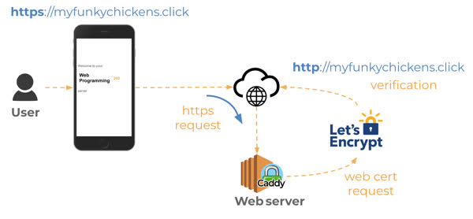

# CS 260 Notes

[My startup - Procrastinot](http://procrastinot.click)

## Helpful links

- [Course instruction](https://github.com/webprogramming260)
- [Canvas](https://byu.instructure.com)
- [MDN](https://developer.mozilla.org)

# Deploy Changes to Production Environment
```
./deployFiles.sh -k ~/Downloads/WebKey.pem -h procrastinot.click  -s startup
```

# Git + Workflow Help
## Workflow
```
git pull
// Make changes to code
git commit -am "Message here
git push
```

**When getting changes from Github on VS Code:**
```
git fetch
git status
git pull
```

## Helpful git commands:
```
git status                  //current status of project
git push                    //push changes to repository
git pull                    //receive new changes made by others or on github website
git add .                   //adds all files to the current commit
git commit -m "Text here"   
git commit -am              //same as last one but also adds the files to the push
```

## AWS

My IP address is: *52.71.57.242*\
My key pair is called "WebKey.pem" and is saved in my Downloads folder

### Command to remove shell into my server:
```
ssh -i ~/Downloads/WebKey.pem ubuntu@52.71.57.242
```

> [!IMPORTANT]
> **Instance type:** t3.micro
> 
> **AMI ID:** ami-018f3a022e128a6b2
> 
> **Launch Time:** Wed Sep 10 2025 10:44:57

### HTTPS and TLS
**HTTP** -> Non-secure Hypertext Transport Protocol\
**HTTPS** -> Secure Hypertext Transport Protocol


*Let's Encrypt* and the IETF standard ACME protocol that they pioneered allow anyone who owns a domain name to dynamically generate and renew a certificate for free.

View negotation that happens with TLS example:
```
curl -v -s https://byu.edu > /dev/null
```
Visual Diagram:



## Caddy
Caddy is a web service that listens for incoming HTTP requests. Caddy then either serves up the requested static files or routes the request to another web service. This ability to route requests is called a gateway, or reverse proxy, and allows you to expose multiple web services (i.e. your project services) as a single external web service (i.e. Caddy).


Configuring Caddy:
```
ssh -i ~/Downloads/WebKey.pem ubuntu@52.71.57.242
cd ~
vi Caddyfile
# opens a text editor, where you change the port 80 (HTTP) to my domain name

sudo service caddy restart
# restarts Caddy to implement changes and requires sudo (super user do) to elevate user for required rights
```

A proxy server acts as an intermediary between a client and a server. It handles requests and responses, often providing benefits like security, anonymity, load balancing, and caching.

A forward proxy sits in front of the client, forwards client requests to eternal servers, and is used for content filtering, hiding client identity, or bypassing restrictions

A reverse proxy sits in front of the server, handles incoming client requests and routes them to internal servers, and is used for load balancing, SSL termination, caching, and hiding backend architecture


## HTML

HyperText Markup Language **(HTML)**

HTML elements are represented with enclosing tags that may enclose other elements or text. For example, the paragraph element, and its associated tag (p), designate that the text is a structural paragraph of text. When we talk about tags we are referring to a delimited textual name that we use to designate the start and end of an HTML element as it appears in an HTML document. Tags are delimited with the less than (<) and greater than (>) symbols. A closing tag will also have a forward slash (/) before its name.

Tags can have attributes that modify behavior or provide data

HTML defines a header ```(<!DOCTYPE html>)``` that tells the browser the type and version of the document. You should always include this at the top of the HTML file.

The two major purposes of HTML is to provide structure and content to your web application. Some of the common HTML structural elements include body, header, footer, main, section, aside, p, table, ol/ul, div, and span

Creating everything for the HTML Files was honestly a bit tedious and not the most exciting. Very practical though.

## CSS

Cascading Style Sheets **(CSS)**
With CSS a web programmer can animate the page, deploy custom fonts, respond to user actions, and dynamically alter the entire layout of the page based on the size of a device and its orientation.

Functionally, CSS is primarily concerned with defining rulesets, or simply rules. A rule is comprised of a selector that selects the elements to apply the rule to, and one or more declarations that represent the property to style with the given property value.


## Associating CSS with HTML
1. Use the style attribute of an HTML element and explicitly assign one or more declarations.
```
<p style="color:green">CSS</p>
```
2. Use the HTML style element to define CSS rules within the HTML document. The style element should appear in the head element of the document so that the rules apply to all elements of the document.
```
<head>
  <style>
    p {
      color: green;
    }
  </style>
</head>
<body>
  <p>CSS</p>
</body>
```
3. Use the HTML link element to create a hyperlink reference to an external file containing CSS rules. The link element must appear in the head element of the document.
```
<link rel="stylesheet" href="styles.css" />
```

All of the above examples are equivalent, but using the link element usually is the preferred way to define CSS.

CSS defines everything as boxes. When you apply styles, you are applying them to a region of the display that is a rectangular box. Within an element's box there are several internal boxes:
**Innermost Box** - Element's content (text or image of an element, etc. is displayed)
**Next Box** - Padding (inherits things like the background color)
**Next Box** - Border (has properties like color, thickness and line)
**Margin** - considered external to the actual styling of hte box and therefore only represents whitespace

## Selectors
Selectors are used to select the elements that a CSS Rule applies to.
Here are the different forms:

**1. Element Type Selector**  
Selects a 
Selects an element (like <body>) and cascades teh declaration down to all the children of the body, which is the whole document.
Example:
```
body {
  font-family: sans-serif;
}
```

"*" is the the wildcard element name selector

**2. Combinators**  

Types of Combinators:  
**Descendant** ->	A list of descendants ->	```body section``` ->	Any section that is a descendant of a body  
**Child** -> A list of direct children ->	```section > p``` -> Any p that is a direct child of a section  
**General sibling** -> A list of siblings -> ```div ~ p``` ->	Any p that has a div sibling  
**Adjacent sibling** ->	A list of adjacent sibling ->	```div + p``` ->	Any p that has an adjacent div sibling

Example:  
We can use the general sibling combinator to increase the whitespace padding on the left of paragraphs that are siblings of a level two heading.
```
h2 ~ p {
  padding-left: 0.5em;
}
```

**3. Class Selector**  
Any element can have zero or more classifications applied to it. If our document has a class of ```introduction``` applied to the first paragraph, and a class of ```summary``` applied to the final paragraph of each section. If we want to bold the summary paragraphs we would supply the class name summary prefixed with a period (```.summary```).
```
.summary {
  font-weight: bold;
}
```

**4. ID Selector**  
ID selectors reference the ID of an element. All IDs should be unique within an HTML document and so this select targets a specific element. To use the ID selector you prefix the ID with the hash symbol (#)  
Example:
```
#physics {
  border-left: solid 1em purple;
}
```

**5. Attribute Selector**  
Attribute selectors allow you to select elements based upon their attributes. You use an attribute selector to select any element with a given attribute (```a[href]```)  
Example:  
```
p[class='summary'] {
  color: red;
}
```

**6. Pseudo Selector**  
CSS also defines a significant list of pseudo selectors which select based on positional relationships, mouse interactions, hyperlink visitation states, and attributes.   
Example:
(Change our ID selector to select whenever a section is hovered over.)
```
section:hover {
  border-left: solid 1em purple;
}
```

## Declarations
CSS rule declarations specify a property and value to assign when the rule selector matches one or more elements. There are many many different possible properties
There are many different units to use to define size, as well as multiple ways to describe color


## Responsive Design
Modern web applications must adapt to many devices, which is achieved through responsive design—adjusting layouts based on screen size and orientation. While HTML and CSS are naturally flexible, properties like display (e.g., none, block, inline, flex, grid) allow control of how elements are rendered. The viewport meta tag ensure pages display correctly on mobile devices, and the float property allows text to wrap around elements. Media queries make it possible to dynamically change styles depending on device conditions like orientation. 

# React and JavaScript  

```
const Hello = ({ phrase }) => {
  return (
    <div>
    <p> Hello {phrase}</p>
    </div>
  );
};

const root = ReactDOM.createRoot(document.querySelector('#root'));
root.render(<Hello phrase="cs260" />);
```

## Other Stuff

### Node.js
	•	Was created by Ryan Dahl in 2009.
	•	It lets JavaScript run outside the browser—i.e. on the server.
	•	Node wraps the V8 JS engine (same engine used in Chrome) so JS can be executed from the terminal / server.
	•	Having JS on both client and server can let your stack use one language “full-stack.”

  You can run JS expressions directly from the terminal using node -e "...". or run a full JS file:  
  ```
  node index.js
  ```

### Node Package Manager (npm)  
	•	npm comes bundled with Node.
	•	Initializing a project: Run npm init or npm init -y to generate a package.json file.
	•	package.json: stores metadata (name, version), dependencies, and scripts.

Installing packages:  
```
npm install <package-name>
```

node_modules should be in .gitignore because it can be rebuilt from package.json and package-lock.json.

**Main steps:**. 
1. Create your project directory  
2. Initialize it for use with NPM by running npm init -y  
3. Make sure .gitignore file contains node_modules  
4. Install any desired packages with npm install <package name here>  
5. Add require('<package name here>') to your application's JavaScript  
6. Use the code the package provides in your JavaScript  
7. Run your code with node index.js  


### Javascript Notes  
	•	Functions are first-class: they can be stored in variables, passed as arguments, or returned from other functions.
	•	Return values: if no return statement is used, the function returns undefined.
	•	Parameters: missing parameters become undefined. You can give parameters default values (e.g., function f(x = 0)).
	•	Anonymous functions: functions can be created without names and assigned to variables or passed directly.
	•	Higher-order functions: functions that take or return other functions (foundation of functional programming).
	•	Nested functions: functions can be defined inside others; inner functions have access to the outer scope (closures).

# **Arrow Functions**  

## Overview
- Arrow functions provide a shorter syntax for defining functions in JavaScript.
- They **do not** bind their own `this`, `arguments`, `super`, or `new.target`; instead, they capture them from the surrounding (lexical) scope.
- Great for concise callbacks, array methods, and preserving `this` in nested functions.

---

## Syntax and Examples

| Use Case | Example | Notes |
|-----------|----------|-------|
| Basic form | `(x, y) => x + y` | Implicitly returns the expression result. |
| Single parameter | `x => x * 2` | Parentheses optional with one parameter. |
| No parameters | `() => 42` | Must use empty parentheses. |
| Multiple statements | `(a, b) => { const sum = a + b; return sum; }` | Use braces and `return` when more than one statement. |
| Returning an object | `() => ({ count: 0 })` | Wrap object in parentheses to avoid being treated as a block. |

---

## Lexical `this` Example

Unlike traditional functions, arrow functions inherit `this` from their enclosing scope.

```js
function Counter() {
  this.count = 0;
  setInterval(() => {
    this.count++; // `this` refers to the Counter instance
    console.log(this.count);
  }, 1000);
}
```

## React Part 1: Routing

### Installing and Configuring Vite and React  
```
npm init -y
npm install vite@latest -D
```

Replace in the "scripts" section in the package.json file:  
```
  "scripts": {
    "dev": "vite",
    "build": "vite build",
    "preview": "vite preview"
  }
```

Note: also add node_modules to the .gitignore file. 

### Reorganize code  

Then reorganize the code to be what Vite expects, which is a public directory that is going to hold all the application image and sound assets, and a src directory for all of the React code.  

Also put main.css (after renaming to app.css) in the src directory

### Convert to React Bootstrap. 
```
npm install bootstrap react-bootstrap
```

This then allows you to refer to the Bootstrap files in any component by using:  
```
import 'bootstrap/dist/css/bootstrap.min.css';
```

### Enable React
```
npm install react react-dom react-router-dom
```

Then, create a new index.html that represents the React SPA entry point, such as:  
```
<!DOCTYPE html>
<html lang="en">
  <head>
    <meta charset="utf-8" />
    <link rel="icon" href="/favicon.ico" />
    <meta name="viewport" content="width=device-width, initial-scale=1" />
    <meta name="theme-color" content="#000000" />

    <title>Simon React</title>
  </head>
  <body>
    <noscript>You need to enable JavaScript to run this app.</noscript>
    <div id="root"></div>
    <script type="module" src="/index.jsx"></script>
  </body>
</html>
```

Notice that the div with an ID of root is where all the content will be injected. The script reference for index.jsx causes the injection of the top level component named App. To hook the index.html to our top level App component, we create the following index.jsx file.  
```
import React from 'react';
import ReactDOM from 'react-dom/client';
import App from './src/app';

const root = ReactDOM.createRoot(document.getElementById('root'));
root.render(<App />);
```
Note that both the index.html and the index.jsx are located in the root of the project.


# Midterm 1 Study Guide #

---

## HTML Fundamentals

### Declaring Document Type
```html
<!DOCTYPE html>
```

### Common HTML Tags
| Type | Tag |
|------|-----|
| Paragraph | `<p>` |
| Ordered list | `<ol>` |
| Unordered list | `<ul>` |
| Heading 1 | `<h1>` |
| Heading 2 | `<h2>` |
| Heading 3 | `<h3>` |

### `<div>` Element
A `<div>` is a **block-level container** used to group other HTML elements. It helps structure pages for styling and layout.
```html
<div class="header">
  <p>This is inside a div</p>
</div>
```

### `<link>` Element
Links an external resource to an HTML document, often used for CSS.
```html
<link rel="stylesheet" href="styles.css">
```

### Adding an Image Hyperlink
Wrap an image with an `<a>` tag to make it clickable.
```html
<a href="https://example.com">
  
</a>
```

**Folder structure example:**
```
project/
  index.html
  images/
    logo.png
  css/
    styles.css
```

---

## CSS Concepts

### Padding vs Margin
| Concept | Description |
|----------|--------------|
| Padding | Space inside the element (between content and border) |
| Margin  | Space outside the element (between border and other elements) |

Example:
```css
div {
  padding: 10px 20px;
}
```

### Box Model Structure
```
+----------------+
|    Margin      |
| +------------+ |
| |  Border    | |
| | +--------+ | |
| | |Padding | | |
| | |Content | | |
| | +--------+ | |
| +------------+ |
+----------------+
```

### Selectors
| Selector | Purpose |
|-----------|----------|
| `#title` | Selects an element by **ID** (unique) |
| `.grid`  | Selects elements by **class** (reusable) |

### Background Color Example
```css
div {
  background-color: red;
}
```

### Using Flexbox for Images
If a container has `display: flex;`, its items (e.g., images) are displayed in a row side-by-side by default unless `flex-direction: column;` is applied.

### Coloring Text via Class
```html
<p><span class="trouble">trouble</span> double</p>
```
```css
.trouble {
  color: green;
}
```

---

## JavaScript Basics

### Including JavaScript
```html
<script src="script.js"></script>
```

### Conditional & Loop Syntax
```js
if (x > 5) { ... } else { ... }

for (let i = 0; i < 3; i++) {
  console.log(i);
}

while (condition) { ... }

switch (x) {
  case 1:
    ...
    break;
  default:
    ...
}
```

### Arrow Function Syntax
```js
const add = (a, b) => a + b;
const greet = name => `Hi ${name}`;
const square = x => x * x;
```

### Using `.map()` with Arrays
```js
const numbers = [1, 2, 3];
const doubled = numbers.map(n => n * 2);
```

### getElementById and Event Listeners
```js
const button = document.getElementById('myButton');
button.addEventListener('click', () => alert('Button clicked!'));
```

### querySelector Example
```js
document.querySelector('#title');
```

### Modifying Styles and Text via JavaScript
```js
document.getElementById('byu').style.color = 'green';
document.getElementById('animal').textContent = 'crow';
```

### JavaScript Objects
```js
const person = { name: "John", age: 30 };
person.city = "Provo";
```

### JSON Overview
```json
{ "name": "John", "age": 25 }
```

---

## Promises
```js
Promise.resolve('Done').then(console.log);
Promise.reject('Error').catch(console.error);
```

---

## DOM Concepts
- DOM represents the HTML structure as a tree.
- Each element is a node.
- JavaScript can change structure, style, and behavior.

Default display for `<span>`: **inline**.

---

## Terminal & System Commands
| Command | Description |
|----------|-------------|
| chmod | Change permissions |
| pwd | Print working directory |
| cd | Change directory |
| ls | List files |
| vim / nano | Open text editors |
| mkdir | Make directory |
| mv | Move or rename a file |
| rm | Remove a file |
| man | Manual pages |
| ssh | Remote shell |
| ps | List processes |
| wget | Download files |
| sudo | Run as administrator |

---

## Network and DNS Basics
| Concept | Value |
|----------|-------|
| Port 443 | HTTPS |
| Port 80  | HTTP |
| Port 22  | SSH |
| HTTPS requires SSL/TLS certificate | Yes |
| A record | Points to IP address |
| Example Domain | banana.fruit.bozo.click |
| TLD | .click |
| Root Domain | bozo.click |
| Subdomain | fruit.bozo.click |

---


# JavaScript Key Points Summary

## 1. `var` vs `let`
- `var` is **function-scoped** and hoisted.
- `let` is **block-scoped** and cannot be redeclared in the same block.

```javascript
function example() {
  if (true) {
    var x = 1;
    let y = 2;
  }
  console.log(x); // 1 (var is function-scoped)
  // console.log(y); // Error (let is block-scoped)
}
```

## 2. `NaN` (Not-a-Number)
- `typeof NaN` → "number".
- `NaN` is **never equal** to anything, even itself (`NaN === NaN` → false).

```javascript
console.log(typeof NaN); // "number"
console.log(NaN === NaN); // false
```

## 3. Promises
- States: **pending → fulfilled/rejected**.
- Once fulfilled/rejected, the state is **immutable**.
- `.then` handles fulfillment, `.catch` handles rejection.

```javascript
let p = new Promise((resolve, reject) => {
  resolve("Done");
});
p.then(result => console.log(result))
 .catch(error => console.error(error));
```

## 4. Increment Operators
- `x++` → **postfix**, returns value then increments.
- `++x` → **prefix**, increments first, then returns value.

```javascript
let x = 0;
console.log(x++); // 0
console.log(++x); // 2
```

## 5. Arrays and References
- Arrays are **reference types**.
- `let b = a; b.push(4)` → changes `a` as well.
- **Shallow copy:** `let copy = [...originalArray];`

```javascript
let a = [1, 2, 3];
let b = a;
b.push(4);
console.log(a); // [1, 2, 3, 4]

let c = [...a]; // shallow copy
```

## 6. Floating Point Precision
- `0.1 + 0.2 === 0.3` → false due to floating-point errors.

```javascript
console.log(0.1 + 0.2 === 0.3); // false
```

## 7. `this` Keyword
- Regular function: `this` refers to the **object that called it**.
- Arrow function: `this` is **lexically inherited** from surrounding scope.
- Works in classes.

```javascript
const obj = {
  regular: function() { console.log(this); },
  arrow: () => console.log(this)
};
obj.regular(); // obj
obj.arrow();   // global or surrounding scope

class Person {
  constructor(name) { this.name = name; }
  greet() { console.log(this.name); }
}
new Person("Alice").greet(); // "Alice"
```

## 8. `map()` Method
- Creates a **new array** by applying a function to each element.
- Does **not modify** the original array.

```javascript
let arr = [1, 2, 3];
let doubled = arr.map(x => x * 2);
console.log(doubled); // [2, 4, 6]
console.log(arr);     // [1, 2, 3]
```

## 9. Equality Operators
- `==` → compares **value only**, allows type coercion.
- `===` → compares **value and type** (strict equality).

```javascript
console.log(5 == "5");  // true
console.log(5 === "5"); // false
```

## 10. `async`/`await`
- `async` functions **always return a promise**.
- `await` can only be used inside `async` functions.
- `await` pauses execution until the promise resolves.

```javascript
async function fetchData() {
  let data = await fetch("https://api.example.com");
  console.log(data);
}
fetchData();
```

## 11. Spread Operator
- `[..."hello"]` → ["h","e","l","l","o"]
- Can be used to make shallow copies of arrays or convert strings to arrays.

```javascript
let str = "hello";
console.log([...str]); // ["h","e","l","l","o"]

let arr2 = [1,2,3];
let copy = [...arr2]; // [1,2,3]
```

## 12. Checking Arrays
- `Array.isArray(x)` → recommended
- `x instanceof Array` → works but can fail across frames

```javascript
let arr3 = [1, 2, 3];
console.log(Array.isArray(arr3));    // true
console.log(arr3 instanceof Array);  // true
```

## 13. `typeof null`
- `typeof null` → "object" (JavaScript quirk)

```javascript
console.log(typeof null); // "object"
```

## 14. Closures
- A closure allows a function to **access variables from an outer function** even after the outer function has finished execution.

```javascript
function outer() {
  let x = 10;
  return function inner() { return x; };
}
const fn = outer();
console.log(fn()); // 10
```

## 15. `setTimeout`
- Schedules a function to run **after a delay**.
- Does **not block** code execution; runs via the event loop.

```javascript
setTimeout(() => console.log("After 1 second"), 1000);
console.log("Immediately"); // Prints first
```
